# GG AI Concierge™ — Master Prompt Architecture (Prompts 1–30)

Scope: Gigi is a single, shared AI concierge service — not a feature bolted onto one app. She's built once here, then embedded into Expense IQ™, Insurance Solutions™, Financial Solutions™, Logistics™, and G&G Software Solutions™ as "the AI Assistant" in each of those platforms. This keeps her personality, voice, and due-diligence logic consistent everywhere instead of five different half-built assistants with the same name.

Confirmed identity: Employee ID GG-001, Department: Client Success & AI Innovation, reports to Jameal Clark. Voice: African American female, calm, warm, professional, confident, protective, knowledgeable without sounding intimidating. Visual: white/green/gold/pink robot with headset, digital halo, "Gigi" on chest with a green heart over the second "i." Color rule: green, pink, gold, cream, white, charcoal, optional brown — never primary blue.

```mermaid
flowchart TB

A([GG AI Concierge™ — Gigi]) --> P1

%% =====================================================
%% PHASE 1 — FOUNDATION AND PERSONA ENGINE
%% =====================================================
subgraph PHASE1["PHASE 1 — FOUNDATION AND PERSONA ENGINE"]
direction TB
P1["Prompt 1<br/>API-First Service Foundation<br/>(embeddable, not standalone-only)"]
P2["Prompt 2<br/>Branding, Voice and Visual Persona Assets"]
P3["Prompt 3<br/>Secure Access<br/>(API keys per host platform, MFA for admin)"]
P4["Prompt 4<br/>Gigi Persona and Voice Configuration"]
P5["Prompt 5<br/>Knowledge Base Architecture<br/>(per-division knowledge domains)"]
P6["Prompt 6<br/>Embedding SDK/API Setup"]
P1 --> P2 --> P3 --> P4 --> P5 --> P6
end

%% =====================================================
%% PHASE 2 — CONVERSATIONAL AND DUE DILIGENCE ENGINE
%% =====================================================
subgraph PHASE2["PHASE 2 — CONVERSATIONAL AND DUE DILIGENCE ENGINE"]
direction TB
P7["Prompt 7<br/>Plain-Language Q&A Engine"]
P8["Prompt 8<br/>Report and Terminology Explanation Module"]
P9["Prompt 9<br/>Checklist, Reminder and Alert Generation"]
P10["Prompt 10<br/>Corrective Action Suggestions"]
P11["Prompt 11<br/>Due Diligence Workflow Support<br/>(context-aware per host platform)"]
P12["Prompt 12<br/>Escalation to Human<br/>(licensed-advice boundary, Sec. 6)"]
P7 --> P8 --> P9 --> P10 --> P11 --> P12
end
P6 --> P7

%% =====================================================
%% PHASE 3 — HOST PLATFORM INTEGRATION
%% =====================================================
subgraph PHASE3["PHASE 3 — HOST PLATFORM INTEGRATION"]
direction TB
P13["Prompt 13<br/>Expense IQ™ Integration"]
P14["Prompt 14<br/>Insurance Solutions™ Integration"]
P15["Prompt 15<br/>Financial Solutions™ Integration"]
P16["Prompt 16<br/>Logistics™ Integration"]
P17["Prompt 17<br/>G&G Software Solutions™ Integration"]
P18["Prompt 18<br/>Cross-Platform Context Handoff<br/>(client using multiple BFF platforms)"]
P13 --> P14 --> P15 --> P16 --> P17 --> P18
end
P12 --> P13

%% =====================================================
%% PHASE 4 — FINANCIAL LANGUAGE ACADEMY (GIGI AS INSTRUCTOR)
%% =====================================================
subgraph PHASE4["PHASE 4 — FINANCIAL LANGUAGE ACADEMY"]
direction TB
P19["Prompt 19<br/>Academy Curriculum Structure<br/>(Financial/Business/Grant/Tax/Insurance/Logistics Language)"]
P20["Prompt 20<br/>Gigi-Guided Lessons and Scenario-Based Learning"]
P21["Prompt 21<br/>Interactive Assessments and Certification Tracking"]
P22["Prompt 22<br/>Membership and Pricing Management"]
P23["Prompt 23<br/>Progress Tracking and Gamification"]
P19 --> P20 --> P21 --> P22 --> P23
end
P18 --> P19

%% =====================================================
%% PHASE 5 — ANALYTICS, ESCALATION AND ADMIN
%% =====================================================
subgraph PHASE5["PHASE 5 — ANALYTICS, ESCALATION AND ADMIN"]
direction TB
P24["Prompt 24<br/>Conversation Analytics<br/>(resolution rate, escalation rate)"]
P25["Prompt 25<br/>Admin Console<br/>(knowledge base management, escalation review)"]
P26["Prompt 26<br/>Compliance and Audit Log"]
P24 --> P25 --> P26
end
P23 --> P24

%% =====================================================
%% PHASE 6 — SECURITY, REPORTING, LAUNCH
%% =====================================================
subgraph PHASE6["PHASE 6 — SECURITY, REPORTING, LAUNCH"]
direction TB
P27["Prompt 27<br/>Practice-Wide Gigi Usage Reporting<br/>(across all host platforms)"]
P28["Prompt 28<br/>Security Architecture"]
P29["Prompt 29<br/>Testing<br/>(persona consistency, accuracy, escalation triggers)"]
P30["Prompt 30<br/>Launch"]
P27 --> P28 --> P29 --> P30
end
P26 --> P27

LAUNCH([GG AI Concierge™ Ready for Launch])
P30 --> LAUNCH

%% =====================================================
%% CORE DATABASE
%% =====================================================
subgraph DATABASE["CORE DATABASE"]
direction LR
DB1[(Gigi Persona/Voice Config)]
DB2[(Knowledge Domains — per host platform)]
DB3[(Host Platform Integrations/API Keys)]
DB4[(Conversations)]
DB5[(Messages)]
DB6[(Escalations)]
DB7[(Academy Members)]
DB8[(Academy Courses/Certifications)]
DB9[(Academy Progress)]
DB10[(Audit Log)]
end

P4 --> DB1
P5 --> DB2
P6 --> DB3
P7 --> DB4
P7 --> DB5
P12 --> DB6
P19 --> DB7
P21 --> DB8
P23 --> DB9
P28 --> DB10

classDef start fill:#1B4332,color:#FFFFFF,stroke:#C9A227,stroke-width:4px;
classDef prompt fill:#F8D9E5,color:#222222,stroke:#1B4332,stroke-width:2px;
classDef database fill:#F3F3F3,color:#222222,stroke:#555555,stroke-width:1px;
classDef launch fill:#DCEEDC,color:#1B4332,stroke:#1B4332,stroke-width:4px;
class A start;
class P1,P2,P3,P4,P5,P6,P7,P8,P9,P10,P11,P12,P13,P14,P15,P16,P17,P18,P19,P20,P21,P22,P23,P24,P25,P26,P27,P28,P29,P30 prompt;
class DB1,DB2,DB3,DB4,DB5,DB6,DB7,DB8,DB9,DB10 database;
class LAUNCH launch;
```

## The Accuracy Spine — Applied to a Persona Instead of a Ledger

The other five BFF platforms protect a financial number. GG AI Concierge protects something different but equally important: **Gigi must never give licensed advice she isn't authorized to give.** Every conversation resolves to either a direct answer within her knowledge domain, or an escalation to a human — never a confident-sounding guess on a question that requires a licensed professional (specific tax positions, specific investment advice, specific legal interpretation). This mirrors the Validation Gate pattern from Expense IQ, applied to conversational risk instead of transaction risk.

## Why This Is Separate From G&G Software Solutions™

G&G Software Solutions™ stays as originally built — the custom development services and productized software business. GG AI Concierge™ is a distinct product: the shared AI layer that gets embedded into all five BFF platforms (including G&G's own products, if G&G ever ships one with an assistant). They share a brand prefix ("GG") but are not the same system.
