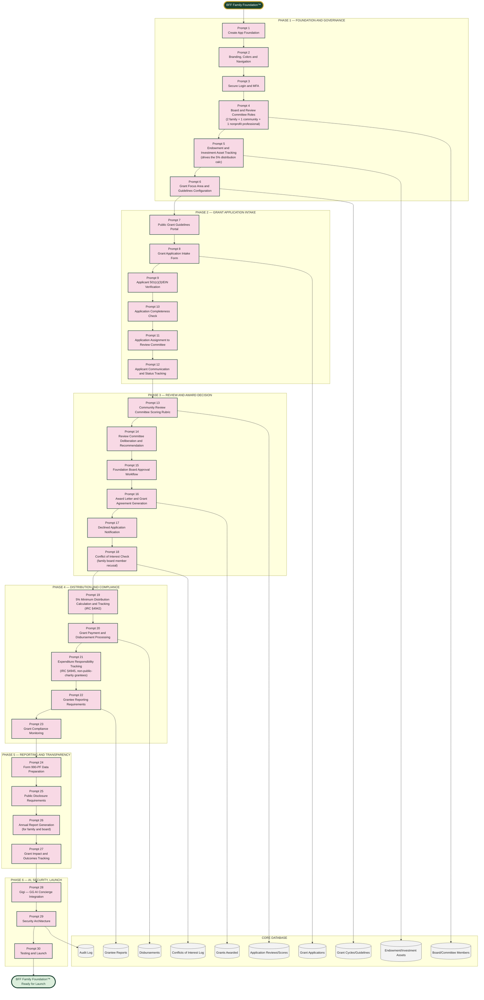

# BFF Family Foundation™ — Master Prompt Architecture (Prompts 1–30)

Scope: a private 501(c)(3) foundation's own grant-*making* platform — the inverse of every other BFF platform, which helps clients seek or manage grants/funding. This one manages the Foundation's own endowment, publishes guidelines, receives applications from outside nonprofits, and distributes grants under IRS private foundation rules.

Confirmed structure: Private Foundation under IRC §501(c)(3). Minimum 5% annual distribution of net investment assets (IRC §4942). Funded by 10% of annual enterprise distributions plus family gifts and public contributions. Foundation Board: 2 family members + 1 community member + 1 nonprofit sector professional. Form 990-PF filed annually by BFF Grant & Nonprofit Solutions. Focus areas: financial literacy education, childcare access, community development, historic preservation. Grant range: $5,000–$50,000 initially. Annual cycle with published guidelines and a community review committee.

## The Accuracy Spine — Applied to Federal Excise Tax Exposure

Every other BFF platform protects a client's number. This one protects the Foundation itself from federal penalty excise taxes. The 5% minimum distribution requirement (IRC §4942) isn't a best practice — falling short triggers a 30% excise tax on the undistributed amount, and it compounds if uncorrected. Every grant tracks toward this running total in real time, not just at year-end when it's too late to course-correct.

## Why This Is a Different Shape Than Every Other BFF Platform

Every other platform in this suite helps a client get money (grants, insurance payouts, client billing) or track money they've spent. This platform gives money away, under a body of tax law that penalizes giving away *too little*, not too much. That inversion is why Phase 4 (Distribution and Compliance) exists as its own phase rather than being folded into generic "billing," and why self-dealing and expenditure responsibility get their own compliance gates in the Technical Specification.
