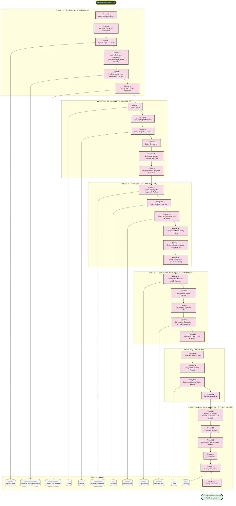

# BFF Insurance Solutions™ — Master Prompt Architecture (Prompts 1–33)

Scope confirmed: full lifecycle (lead generation → quoting → policy/client management → commissions → client portal), solo producer today with multi-agent-ready architecture, all lines of insurance (life, health, P&C — built to scale as licensing expands).

## The Accuracy Spine (same principle as Expense IQ)

Every lead, quote, application, and policy must resolve to exactly one row in the **Policies** table (once bound) or **Leads/Quotes** table (pre-bind), tagged to exactly one Client/Household and one Carrier/Product — and every commission must trace back to exactly one bound policy. No module writes a production number directly into a report; every report reads from Policies + Commissions.
