# BFF Logistics™ — Property Preservation — Master Prompt Architecture (Prompts 1–33)

Scope confirmed: property preservation field services platform, multi-state territory (VA, PA, MD, WV, NJ), solo today with scalable field-tech-network architecture, mixed client base (property preservation companies, banks, asset managers — existing plus new).

```mermaid
flowchart TB

A([BFF Logistics™ — Property Preservation]) --> P1

%% =====================================================
%% PHASE 1 — FOUNDATION
%% =====================================================
subgraph PHASE1["PHASE 1 — FOUNDATION"]
direction TB
P1["Prompt 1<br/>Create App Foundation"]
P2["Prompt 2<br/>Branding, Colors and Navigation"]
P3["Prompt 3<br/>Secure Login and MFA"]
P4["Prompt 4<br/>Field Tech and Coordinator Roles<br/>(solo-ready, scalable to a network)"]
P5["Prompt 5<br/>Multi-State Territory and Coverage Setup<br/>(VA, PA, MD, WV, NJ)"]
P6["Prompt 6<br/>Client and Vendor Directory<br/>(preservation companies, banks, asset managers)"]
P1 --> P2 --> P3 --> P4 --> P5 --> P6
end

%% =====================================================
%% PHASE 2 — WORK ORDER INTAKE AND DISPATCH
%% =====================================================
subgraph PHASE2["PHASE 2 — WORK ORDER INTAKE AND DISPATCH"]
direction TB
P7["Prompt 7<br/>Work Order Intake<br/>(portal, email, API)"]
P8["Prompt 8<br/>Work Order Classification and Service Catalog"]
P9["Prompt 9<br/>Territory-Based Dispatch and Assignment"]
P10["Prompt 10<br/>Deadline and Priority Tracking"]
P11["Prompt 11<br/>Bid Submission Workflow"]
P12["Prompt 12<br/>Work Order Acceptance and Rejection"]
P7 --> P8 --> P9 --> P10 --> P11 --> P12
end
P6 --> P7

%% =====================================================
%% PHASE 3 — FIELD EXECUTION AND DOCUMENTATION
%% =====================================================
subgraph PHASE3["PHASE 3 — FIELD EXECUTION AND DOCUMENTATION"]
direction TB
P13["Prompt 13<br/>Mobile Field Checklist<br/>(per work order type)"]
P14["Prompt 14<br/>Before/After Photo Capture and GPS Tagging"]
P15["Prompt 15<br/>Property Condition Documentation"]
P16["Prompt 16<br/>Time and Materials Logging"]
P17["Prompt 17<br/>Work Order Completion Submission"]
P18["Prompt 18<br/>Rework and Rejection Handling"]
P13 --> P14 --> P15 --> P16 --> P17 --> P18
end
P12 --> P13

%% =====================================================
%% PHASE 4 — COMPLIANCE AND QUALITY CONTROL
%% =====================================================
subgraph PHASE4["PHASE 4 — COMPLIANCE AND QUALITY CONTROL"]
direction TB
P19["Prompt 19<br/>Investor Guideline Compliance Checklist<br/>(FHA/HUD/Fannie Mae/Freddie Mac)"]
P20["Prompt 20<br/>Photo and Documentation QC Review"]
P21["Prompt 21<br/>Compliance Deadline Tracking<br/>(e.g., 24-48hr initial secure)"]
P22["Prompt 22<br/>Field Tech Insurance and Licensing Tracking"]
P23["Prompt 23<br/>Chargeback and Penalty Tracking"]
P19 --> P20 --> P21 --> P22 --> P23
end
P18 --> P19

%% =====================================================
%% PHASE 5 — BILLING AND PAYOUTS
%% =====================================================
subgraph PHASE5["PHASE 5 — BILLING AND PAYOUTS"]
direction TB
P24["Prompt 24<br/>Client-Specific Line-Item Pricing"]
P25["Prompt 25<br/>Invoice Generation<br/>(per work order, batched by client)"]
P26["Prompt 26<br/>Payment and AR Tracking"]
P27["Prompt 27<br/>Field Tech and Subcontractor Payout Tracking"]
P28["Prompt 28<br/>Payout Reconciliation"]
P24 --> P25 --> P26 --> P27 --> P28
end
P23 --> P24

%% =====================================================
%% PHASE 6 — REPORTING, SECURITY, LAUNCH
%% =====================================================
subgraph PHASE6["PHASE 6 — REPORTING, SECURITY, LAUNCH"]
direction TB
P29["Prompt 29<br/>Work Order Status Dashboard"]
P30["Prompt 30<br/>Client-Facing Reporting Portal"]
P31["Prompt 31<br/>AI Assistant"]
P32["Prompt 32<br/>Security Architecture"]
P33["Prompt 33<br/>Testing and Launch"]
P29 --> P30 --> P31 --> P32 --> P33
end
P28 --> P29

LAUNCH([BFF Logistics™ Ready for Launch])
P33 --> LAUNCH

%% =====================================================
%% CORE DATABASE
%% =====================================================
subgraph DATABASE["CORE DATABASE"]
direction LR
DB1[(Field Techs/Coordinators)]
DB2[(Territories)]
DB3[(Clients)]
DB4[(Properties)]
DB5[(Work Orders)]
DB6[(Service Catalog/Pricing)]
DB7[(Photos/Documentation)]
DB8[(Compliance Checklists)]
DB9[(Invoices)]
DB10[(Payouts)]
DB11[(Audit Log)]
end

P3 --> DB1
P5 --> DB2
P6 --> DB3
P7 --> DB4
P7 --> DB5
P8 --> DB6
P14 --> DB7
P19 --> DB8
P25 --> DB9
P27 --> DB10
P32 --> DB11

classDef start fill:#1B4332,color:#FFFFFF,stroke:#C9A227,stroke-width:4px;
classDef prompt fill:#F8D9E5,color:#222222,stroke:#1B4332,stroke-width:2px;
classDef database fill:#F3F3F3,color:#222222,stroke:#555555,stroke-width:1px;
classDef launch fill:#DCEEDC,color:#1B4332,stroke:#1B4332,stroke-width:4px;
class A start;
class P1,P2,P3,P4,P5,P6,P7,P8,P9,P10,P11,P12,P13,P14,P15,P16,P17,P18,P19,P20,P21,P22,P23,P24,P25,P26,P27,P28,P29,P30,P31,P32,P33 prompt;
class DB1,DB2,DB3,DB4,DB5,DB6,DB7,DB8,DB9,DB10,DB11 database;
class LAUNCH launch;
```

## The Accuracy Spine (same principle as the other three BFF platforms)

Every work order resolves to exactly one property, one client, and one assigned field tech. A work order cannot move to "completed" status without passing its compliance checklist (Phase 4) — no exceptions, since missed investor guidelines mean unpaid or charged-back work. Every invoice line item traces back to exactly one completed, QC-approved work order. No module writes a billable amount directly into an invoice without that chain.
