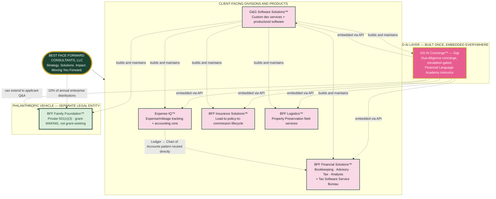

# Best Face Forward™ — Master Enterprise Architecture

This is the top-level view: how Best Face Forward Consultants, LLC, its five client-facing platforms, its shared AI layer, its software builder, and its philanthropic foundation all relate as one system. Each box below has its own complete diagram + technical specification + Grok roadmap already built — this document is the map showing how those seven pieces connect, not a replacement for any of them.

## Reading This Diagram

- **Solid arrows** are structural (who owns what, who funds what).
- **Dashed arrows** are integration relationships — Gigi embeds into every division via API rather than living inside any one of them, and G&G is the division that builds and maintains all the others, including itself and the Foundation.
- **The Foundation sits outside the divisions box** deliberately — it's a separate legal entity (a private foundation, not a division of the LLC), funded *by* the enterprise rather than operating as a revenue line *within* it.

## The One Enterprise-Wide Rule

Every platform in this ecosystem was built around its own version of the same principle: **protect the number or decision that carries real consequences if it's wrong.** Expense IQ protects the Ledger. Insurance protects the bound policy and commission. Financial Solutions protects the tax due diligence gate. Logistics protects the QC-approved work order. GG AI Concierge protects the licensed-advice boundary. BFF Family Foundation protects the federal excise tax exposure on the 5% distribution rule. None of these are decorative — each is the specific thing that would cost real money, real compliance risk, or real client trust if the software got it wrong.
