# G&G Software Solutions™ — Master Prompt Architecture (Prompts 1–33)

Scope confirmed: dual-purpose platform — custom software development services (client-commissioned builds, like Expense IQ) AND productized software (licensed/subscribed products G&G sells directly) — solo-ready today with scalable team structure, mixed client base (existing + new), with Information Systems Monitoring scoped as a future phase (Phase 5) rather than built now.

```mermaid
flowchart TB

A([G&G Software Solutions™]) --> P1

%% =====================================================
%% PHASE 1 — FOUNDATION
%% =====================================================
subgraph PHASE1["PHASE 1 — FOUNDATION"]
direction TB
P1["Prompt 1<br/>Create App Foundation"]
P2["Prompt 2<br/>Branding, Colors and Navigation"]
P3["Prompt 3<br/>Secure Login and MFA"]
P4["Prompt 4<br/>Team Roles and Permissions<br/>(solo-ready, scalable to devs/contractors)"]
P5["Prompt 5<br/>Client and Customer Directory<br/>(service clients vs. product customers vs. both)"]
P6["Prompt 6<br/>Product Catalog Setup<br/>(G&amp;G's own licensable software products)"]
P1 --> P2 --> P3 --> P4 --> P5 --> P6
end

%% =====================================================
%% PHASE 2 — CUSTOM DEVELOPMENT SERVICES
%% =====================================================
subgraph PHASE2["PHASE 2 — CUSTOM DEVELOPMENT SERVICES"]
direction TB
P7["Prompt 7<br/>Lead Capture and Discovery"]
P8["Prompt 8<br/>Project Scoping and Proposal Generator<br/>(fixed bid vs. time and materials)"]
P9["Prompt 9<br/>Project and Sprint Management"]
P10["Prompt 10<br/>Requirements and Spec Repository"]
P11["Prompt 11<br/>Client Review and Deliverable Sign-Off"]
P12["Prompt 12<br/>Project Billing<br/>(milestone or hourly)"]
P7 --> P8 --> P9 --> P10 --> P11 --> P12
end
P6 --> P7

%% =====================================================
%% PHASE 3 — PRODUCTIZED SOFTWARE (SAAS/LICENSING)
%% =====================================================
subgraph PHASE3["PHASE 3 — PRODUCTIZED SOFTWARE"]
direction TB
P13["Prompt 13<br/>Product Listings and Pricing Tiers"]
P14["Prompt 14<br/>Customer Subscription and License Management"]
P15["Prompt 15<br/>Provisioning and Access Control"]
P16["Prompt 16<br/>Renewal, Upgrade and Downgrade Handling"]
P17["Prompt 17<br/>Product Usage Tracking<br/>(seats, API calls, etc.)"]
P18["Prompt 18<br/>Product Support Ticket System"]
P13 --> P14 --> P15 --> P16 --> P17 --> P18
end
P12 --> P13

%% =====================================================
%% PHASE 4 — UNIFIED CRM AND BILLING
%% =====================================================
subgraph PHASE4["PHASE 4 — UNIFIED CRM AND BILLING"]
direction TB
P19["Prompt 19<br/>Unified Client/Customer 360 View"]
P20["Prompt 20<br/>Cross-Sell Detection<br/>(service client to product, product to service)"]
P21["Prompt 21<br/>Unified Invoicing<br/>(project billing + subscription billing)"]
P22["Prompt 22<br/>Revenue Reporting by Line<br/>(dev services vs. product vs. future monitoring)"]
P19 --> P20 --> P21 --> P22
end
P18 --> P19

%% =====================================================
%% PHASE 5 — INFORMATION SYSTEMS MONITORING (FUTURE)
%% =====================================================
subgraph PHASE5["PHASE 5 — INFORMATION SYSTEMS MONITORING (FUTURE PHASE)"]
direction TB
P23["Prompt 23<br/>Monitoring Account Setup<br/>(which client systems are monitored)"]
P24["Prompt 24<br/>Uptime and Performance Monitoring Dashboard"]
P25["Prompt 25<br/>Security and Vulnerability Alerts"]
P26["Prompt 26<br/>Incident Tracking and Response Log"]
P27["Prompt 27<br/>SLA Tracking and Reporting"]
P28["Prompt 28<br/>Monitoring Service Billing<br/>(recurring fee)"]
P23 --> P24 --> P25 --> P26 --> P27 --> P28
end
P22 --> P23

%% =====================================================
%% PHASE 6 — REPORTING, SECURITY, LAUNCH
%% =====================================================
subgraph PHASE6["PHASE 6 — REPORTING, SECURITY, LAUNCH"]
direction TB
P29["Prompt 29<br/>Practice-Wide Revenue Reporting"]
P30["Prompt 30<br/>Team Utilization and Capacity Reporting"]
P31["Prompt 31<br/>AI Assistant"]
P32["Prompt 32<br/>Security Architecture"]
P33["Prompt 33<br/>Testing and Launch"]
P29 --> P30 --> P31 --> P32 --> P33
end
P28 --> P29

LAUNCH([G&G Software Solutions™ Ready for Launch])
P33 --> LAUNCH

%% =====================================================
%% CORE DATABASE
%% =====================================================
subgraph DATABASE["CORE DATABASE"]
direction LR
DB1[(Team/Users)]
DB2[(Clients and Customers)]
DB3[(Products)]
DB4[(Dev Projects)]
DB5[(Sprints/Tasks)]
DB6[(Subscriptions/Licenses)]
DB7[(Support Tickets)]
DB8[(Invoices)]
DB9[(Monitored Systems — future)]
DB10[(Incidents — future)]
DB11[(Audit Log)]
end

P3 --> DB1
P5 --> DB2
P6 --> DB3
P8 --> DB4
P9 --> DB5
P14 --> DB6
P18 --> DB7
P21 --> DB8
P23 --> DB9
P26 --> DB10
P32 --> DB11

classDef start fill:#1B4332,color:#FFFFFF,stroke:#C9A227,stroke-width:4px;
classDef prompt fill:#F8D9E5,color:#222222,stroke:#1B4332,stroke-width:2px;
classDef future fill:#EAEAEA,color:#555555,stroke:#999999,stroke-width:2px,stroke-dasharray: 4 3;
classDef database fill:#F3F3F3,color:#222222,stroke:#555555,stroke-width:1px;
classDef launch fill:#DCEEDC,color:#1B4332,stroke:#1B4332,stroke-width:4px;
class A start;
class P1,P2,P3,P4,P5,P6,P7,P8,P9,P10,P11,P12,P13,P14,P15,P16,P17,P18,P19,P20,P21,P22,P29,P30,P31,P32,P33 prompt;
class P23,P24,P25,P26,P27,P28 future;
class DB1,DB2,DB3,DB4,DB5,DB6,DB7,DB8,DB11 database;
class DB9,DB10 future;
class LAUNCH launch;
```

## The Accuracy Spine (same principle as Expense IQ, Insurance, and Financial Solutions)

Every custom dev project traces to exactly one client and produces invoices tied to exactly one project_id. Every product subscription traces to exactly one customer and exactly one product_id. Revenue reports by line (dev services / product licensing / monitoring) exactly the way Financial Solutions reports bookkeeping vs. advisory vs. tax vs. service bureau revenue separately — no module blends these into one number.

## Why Monitoring Is Phase 5, Dashed and Separate

Phase 5 (Information Systems Monitoring) is drawn with a dashed border because it's confirmed as a **future** capability, not part of the initial build. It's sequenced after the core CRM/billing unification (Phase 4) because monitoring accounts will attach to clients who already exist in the system by the time this phase is built — but it should not block Phases 1–4 and 6 from shipping first.
