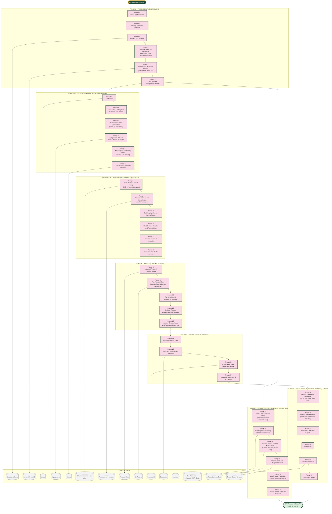

# BFF Financial Solutions™ — Master Prompt Architecture (Prompts 1–33)

Scope confirmed: full financial consulting practice platform, solo today with scalable architecture, starting from zero clients, covering four service lines — bookkeeping/accounting, individual financial advisory, tax preparation, and business financial analysis/reporting.

## The Accuracy Spine (same principle as Expense IQ and Insurance Solutions)

Every client transaction posts to exactly one Chart of Accounts code within that client's own ledger (Phase 3) — this deliberately reuses the same Ledger → Chart of Accounts discipline built for Expense IQ, so bookkeeping clients could eventually be migrated onto Expense IQ itself without a redesign. Every invoice traces back to exactly one engagement; every tax return traces back to exactly one client and one tax year. No module writes a financial fact directly into a report.

## Why Service Bureau Sales Is Its Own Phase, Not Folded Into Existing Modules

Sub-preparers who buy software seats through the service bureau are **wholesale software customers, not BFF clients** — they never touch the Clients/Engagements model in Phase 2, they don't get intake questionnaires, and their activity isn't a consulting engagement. Keeping Phase 7 structurally separate (its own tables: Sub-Preparers, Software Licenses, Service Bureau Revenue) prevents this fundamentally different B2B2B relationship from contaminating the "one client, four engagements" model built for the core practice.
