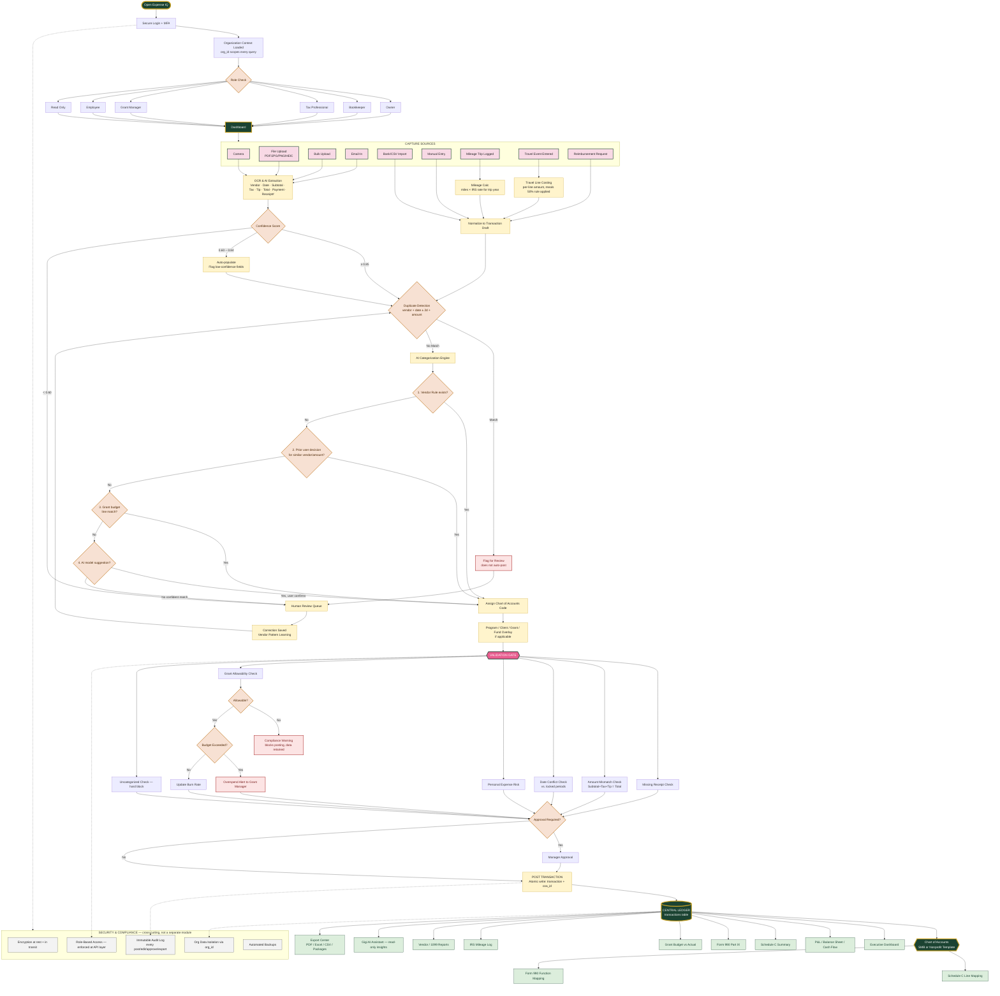

# Expense IQ™ — Unified System Architecture Diagram (Corrected)

This replaces the two earlier diagrams with one accurate picture: every capture source — receipts, bank imports, mileage, travel, reimbursements — funnels through the **same** extraction → validation → categorization → posting pipeline into **one** central Ledger, mapped to **one** Chart of Accounts. Nothing bypasses this spine. Security and role-based access wrap the whole system, not just the login screen.

This matches Sections 2, 6, and 8 of the Technical Specification.

---

## What Changed From the Two Earlier Diagrams

| Before | Now |
|---|---|
| Two separate diagrams (build-order vs. runtime) with no explicit shared spine | One diagram — every capture source visibly converges on the same pipeline before reaching the Ledger |
| Categorization shown as a single box | Categorization shown as the actual 4-tier priority decision (vendor rule → prior decision → grant match → AI model → fallback to review) |
| Validation checks listed as flat sibling nodes | Validation shown as a true gate — nothing reaches POST without clearing it, including the allowability/budget sub-logic |
| Mileage/Travel drawn as side modules feeding "reports" | Mileage/Travel shown feeding the *same* pipeline as receipts — because they're transactions, not just logs |
| Security drawn as one Phase-33 box at the end | Security shown as a cross-cutting layer (dashed lines) touching Auth, the Validation Gate, Posting, and the Ledger — not a bolt-on at launch |

This is the diagram to hand to Grok alongside the Technical Specification — it's the visual form of Sections 2 and 6.
